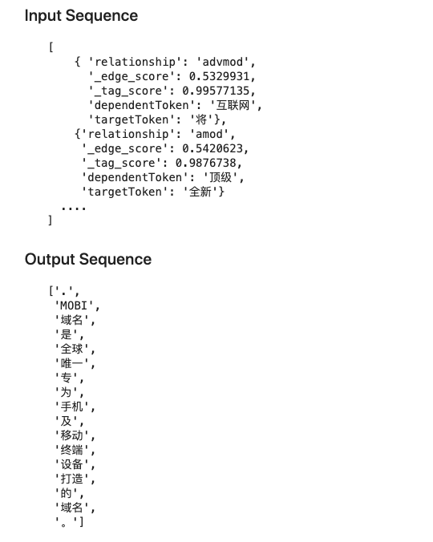

<!-- Stuart -->

# RDFer


## Introduction

Strctured data as inputs are once commonly expected to go through the strctured embedding neural functions, while in this repository we try to demonstrate the efficiency simply by re-arranging the structure of input data themselves. Plus, contradictory to the conventional impression that sequence to sequence pipelines were highly dependent on recurrent neural networks, our model makes a step by only adopting lite attention-based neural networks. We will see how it works here.

## Dependency

- [PyTorch](https://github.com/pytorch/pytorch) >=  1.2.0

## Methodology

* 1. Instead of taking the input as dependency-parsed data, this model flattens the input item as a `sentence` consists of multiple `phrases`. 

In the input `sentence`, we chain it up as a list of triples, tokenized and masked by `SOS_token` and `EOS_token`:

```json
"互联网  advmod  将 [SOS_token]  专  amod  唯一  [SOS_token]  顶级  amod  全新 [SOS_token]  ...  为  top  专  [EOS_token]"
```

And the target output is expected as a list of tokens, where the punctuations serve as the segmentation marks for the origine sentences:

```json
"[MASKED]", "MOBI", "域名", "是", "全球", "唯一", "专", "为", ..., "[MASKED]", "是", "为", "ICANN", "批准", "的", "全新", "国际", "顶级", "域名", "[MASKED]", "其", "致力", "于", "将", ..., "移动设备", "上", "[MASKED]"
```



* 2. Without traditional recurrence mechanism (i.e. recurrent neural networks), we leverage the attention mechanisms to optimize the prediction function between the input distribution and the target distribution:

We use the general design of attention layer from the paper [Attention Is All You Need](https://arxiv.org/abs/1706.03762) [1], denoting the $Key$, $Value$, and$Query$ in the original algorithm 
as $K$ ,$V$, and$Q$, then the attention layer is defined as 

$$Attn(Q,K,V)=softmax(\frac{QK^T}{\sqrt{d_k}})V $$

$$ head_i=Attn(QW_i^Q,KW_i^K,VW_i^V)$$
Then we build the multi-head attention function as follows, the $concat$ is the function to concatenate the tensors,
$$MultH(Q,K,V)=concat(head_1,...,head_i)W^O$$


## Experiments & Comparison

### Results

Recently, the initial training stage (43 batches) is displayed as the plotting below, where denotes the loss values:


### Comparison 

It's feasible and suitable to use [Tree-LSTM](https://arxiv.org/abs/1503.00075) [2] or [Tree-based CNN](https://arxiv.org/abs/1409.5718) [3] for the ablation study on how the different layer structures impact on the encoding part through the whole optimization process, and we can better find baseline from them.

| Models   |      Param      |  Score |
|----------|:-------------:|------:|
| Tree-LSTM |  - | - |
| Tree-based CNN |    -   |   - |
| our model | - |    - |
* details arrive soon


## Instruction 

### Preprocessing

```bash
>python config.py --preprocess=true  --train_dataset=./dataset/train_sample.json  --save_dataset=./dataset/train_sample.pt
```

This command will automatically generate the files below in path `./dataset/`:

```bash
│  input_tensors.pt
│  src.2116.index2word.json
│  src.2116.word2index.json
│  srclex.pkl
│  target_tensors.pt
│  tgt.2214.index2word.json
│  tgt.2214.word2index.json
│  tgtlex.pkl
│  train_sample.json
│
└─ 
```

### Training

```bash
>python config.py --train=true  --model_name=SmoothNLP  --batch_size=62  --num_iter=100  --learning_rate=0.01  
```

The terminal log is like this previous standard output [record](./log.txt):

```bash
* -- Begining model with cpu -- *


 Initiating dataset from raw files... 


 SRC number of tokens:  2116  TGT number of tokens:  2214  

2116 2214
 Dataset loader ready, begin training. 


 Dataset loader length is  119 , save model every batch. 


  - Epoch  1  | batch  0 
 | input lenght:    torch.Size([181, 6]) 
 | target length:    torch.Size([75, 6])  

torch.Size([6, 181, 512])
0 torch.Size([450, 1, 512])
1 torch.Size([75, 6])
 output_gen :  torch.Size([75, 2214, 6])  

 loss: 7.976774215698242


  - Epoch  1  | batch  1 
 | input lenght:    torch.Size([181, 6]) 
 | target length:    torch.Size([75, 6])  

torch.Size([6, 181, 512])
0 torch.Size([450, 1, 512])
1 torch.Size([75, 6])
 output_gen :  torch.Size([75, 2214, 6])  

 loss: 6.059077262878418

 ...
```

## Reference 

[1] Ashish Vaswani et al. (2017) Attention Is All You Need 

[2] Kai Sheng Tai et al. (2015) Improved Semantic Representations From Tree-Structured Long Short-Term Memory Networks

[3] Lili Mou et al. (2014) Convolutional Neural Networks over Tree Structures for Programming Language Processing 

---------------------------

 *contact: erisjchurnng@gmail.com 
